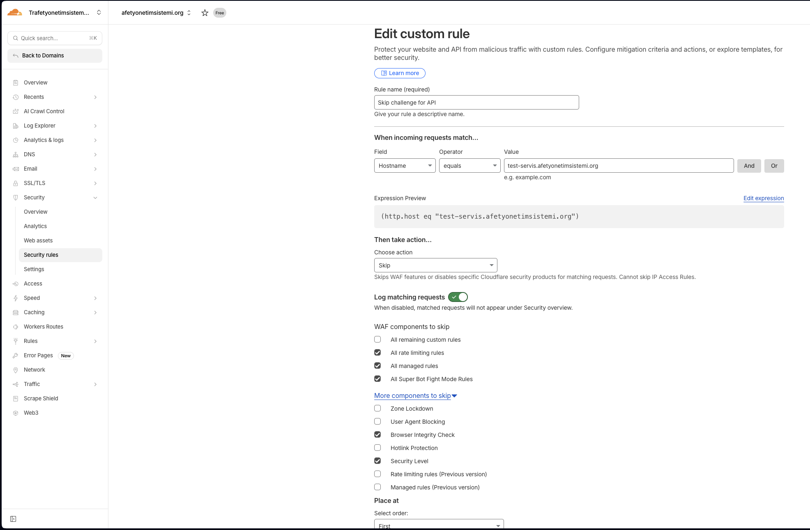

# AYS Back-End Project Setup

## Important Notes

### 🚨 Cloudflare Challenge Page Configuration

**After deployment, you must disable the Cloudflare challenge page for the API subdomain to work properly.**

**Why?** The Cloudflare challenge page (bot protection) will block API requests from your front-end applications. API endpoints need direct access without browser-based challenges.

**Step-by-step configuration:**

1. Log in to your **Cloudflare dashboard**
2. Select your domain (e.g., `domain.org`)
3. Navigate to **Security** → **WAF** (Web Application Firewall)
4. Go to **the Security rules** tab
5. Click **the Create rule** button
6. Configure the custom rule:
   - **Rule name**: `Skip challenge for API` (or any descriptive name)
   - **When incoming requests match...**
     - Field: `Hostname`
     - Operator: `equals`
     - Value: Your API subdomain (e.g., `subdomain.domain.org`)
   - **Then take action...**
     - Choose action: `Skip`
   - **WAF components to skip**:
     - ⬜ All remaining custom rules
     - ✅ All rate limiting rules
     - ✅ All managed rules
     - ✅ All Super Bot Fight Mode Rules
     - ⬜ Zone Lockdown
     - ⬜ User Agent Blocking
     - ✅ Browser Integrity Check
     - ⬜ Hotlink Protection
     - ✅ Security Level
     - ⬜ Rate limiting rules (Previous version)
     - ⬜ Managed rules (Previous version)
7. Click **Deploy** to save the rule

**Without this configuration, your API will not be accessible from front-end applications.**
