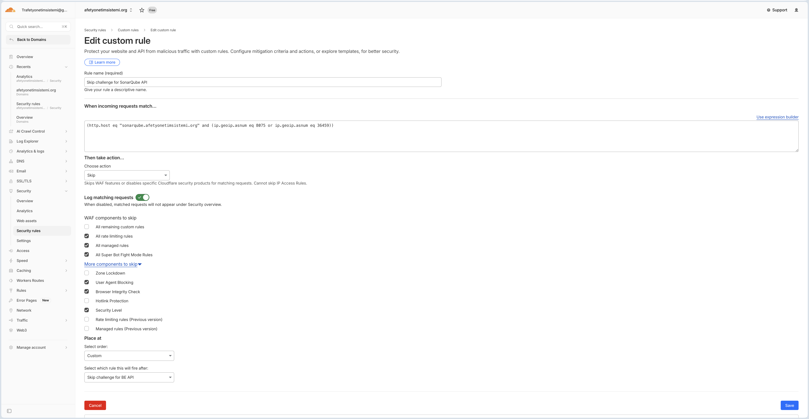

# AYS SonarQube Setup

## Important Notes

### 🚨 Cloudflare WAF Bypass Configuration for SonarQube (CI/CD)

**After deployment, you must configure a Cloudflare WAF exception for your CI/CD pipelines to allow SonarQube analysis to work properly.**

**Why?** Cloudflare's bot protection (Browser Integrity Checks and WAF rules) naturally blocks automated requests coming from CI/CD runners (like GitHub Actions). Because SonarScanner requires access to multiple internal paths (`/api/`, `/batch/`, etc.) and cannot pass JavaScript browser challenges, it receives `403 Forbidden` errors. 

To resolve this securely without exposing our system to the public, we create a "Skip" rule based on the **Autonomous System Number (ASN)** of our CI/CD provider (e.g., GitHub and Microsoft Azure).

**Step-by-step configuration:**

1. Log in to your **Cloudflare dashboard**
2. Select your domain (e.g., `domain.org`)
3. Navigate to **Security** → **WAF** (Web Application Firewall)
4. Go to the **Custom rules** tab
5. Click the **Create custom rule** button
6. Configure the custom rule:
   - **Rule name**: `Skip WAF for CI/CD Pipelines (SonarQube)`
   - **When incoming requests match...** *(Click "Edit expression" on the right and paste the following)*:
     ```text
     (http.host eq "subdomain.domain.org" and (ip.geoip.asnum eq 8075 or ip.geoip.asnum eq 36459))
     ```
     *(Note: ASN 8075 is Microsoft/Azure, and 36459 is GitHub).*
   - **Then take action...**
     - Choose action: `Skip`
   - **WAF components to skip**:
     - ⬜ All remaining custom rules
     - ✅ All rate limiting rules
     - ✅ All managed rules
     - ✅ All Super Bot Fight Mode Rules
     - ⬜ Zone Lockdown
     - ⬜ User Agent Blocking
     - ✅ Browser Integrity Check *(Critical)*
     - ⬜ Hotlink Protection
     - ✅ Security Level
     - ⬜ Rate limiting rules (Previous version)
     - ⬜ Managed rules (Previous version)
7. Click **Deploy** to save the rule



**Security Note:** Even with this WAF bypass in place, your SonarQube server remains secure. Any request coming from these ASNs still requires your highly secure `SONAR_TOKEN` to actually authenticate and submit code analysis.
